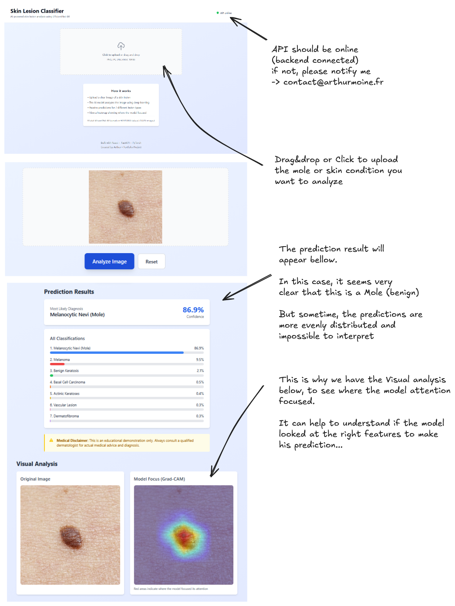
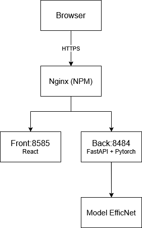

# Skin Lesion Classifier

AI-powered skin lesion analysis using deep learning for educational purposes.

Try it on https://skin-lesion.arthurmoine.fr

## Overview

A full-stack machine learning application that classifies skin lesions into 7 categories using computer vision. Built to demonstrate end-to-end ML deployment, from model training to production.

**⚠️ Medical Disclaimer:** This is an educational project only, with far from perfect accuracy. Always consult a qualified dermatologist for medical advice.

## DEMO



[Architecture](#architecture) | [Local Setup](#local-setup)


---

## Architecture


**Tech Stack:**
- **Frontend:** React 18, Tailwind CSS, Axios
- **Backend:** FastAPI, PyTorch, Pillow
- **Model:** EfficientNet-B0 (pre-trained on ImageNet, fine-tuned on HAM10000)
- **Deployment:** Docker, Docker Compose, Nginx Proxy Manager
- **Infrastructure:** Raspberry Pi 4, Ubuntu Server

---

## 📊 Model Performance

| Metric | Value |
|--------|-------|
| **Validation Accuracy** | 82.2% |
| **Dataset** | HAM10000 (10,015 dermatoscopic images) |
| **Classes** | 7 (melanoma, nevus, basal cell carcinoma, etc.) |
| **Training Strategy** | Transfer learning with early stopping |

**More Performance stats at the end of [Training notebook](notebooks/02_training.ipynb)**

**Key Design Decisions:**
- Split by `lesion_id` (not image) to prevent data leakage
- CPU-optimized inference (~500ms on Raspberry Pi 4)
- Grad-CAM visualization for model interpretability

---

## Features

-  **Drag-and-drop image upload**
-  **7-class skin lesion classification**
-  **Grad-CAM heatmap** showing model attention
-  **Confidence scores** for all predictions
-  **Real-time inference** (<500ms)
-  **HTTPS deployment** with proper error handling

---

## Local Setup

### Prerequisites
- Python 3.11+
- Node.js 22+
- Docker & Docker Compose

### Backend
```bash
git clone https://github.com/yourusername/skin-lesion-classifier
cd skin-lesion-classifier

pip install -r backend/requirements.txt
```
- Download model (if not in repo)
- Place best_model.pth in models/
```bash
uvicorn backend.main:app --reload --port 8000
```

API will be available at `http://localhost:8000/docs`

### Frontend
```bash
cd frontend

npm install

echo "REACT_APP_API_URL=http://localhost:8000" > .env

npm start
```

Frontend will open at `http://localhost:3000`

### Docker (Production)
```bash
docker-compose up -d

# Access
# Frontend: http://localhost:8585
# Backend: http://localhost:8484
```

---

## How It Works

1. **User uploads** a dermatoscopic image
2. **Preprocessing:** Image resized to 224×224, normalized
3. **Inference:** EfficientNet-B0 predicts lesion type
4. **Grad-CAM:** Generates attention heatmap
5. **Response:** Returns predictions + visualization

---

- **Why FastAPI?** Auto-generated docs, async support, type safety
- **Why Docker?** Reproducible deployments, isolation, easy scaling
- **Why Grad-CAM?** Model interpretability for medical applications
- **Why Raspberry Pi?** Why not ? (+ Demonstrates edge deployment capabilities)

---

## Project Structure
```
skin-lesion-classifier/
├── backend/
│   ├── main.py              # FastAPI endpoints
│   ├── gradcam.py           # Grad-CAM implementation
│   └── requirements.txt
├── frontend/
│   ├── src/
│   │   ├── components/      # React components
│   │   ├── api/             # API client
│   │   └── App.js
│   └── Dockerfile
├── src/
│   ├── dataset.py           # PyTorch Dataset
│   ├── model.py             # Model architecture
│   ├── train.py             # Training functions
│   └── transforms.py        # Data augmentation
├── models/
│   └── best_model.pth       # Trained weights (200MB)
├── notebooks/
│   ├── 01_exploration.ipynb
│   └── 02_training.ipynb
├── Dockerfile               # Backend container
├── docker-compose.yml
└── README.md
```

---

## Future Improvements

- [ ] Add model versioning (MLflow)
- [ ] Implement A/B testing for model updates
- [ ] Add user feedback loop for continuous learning
- [ ] Ensemble of multiple models

---

## Author

**Arthur**
- Portfolio: [https://arthurmoine.fr]
- LinkedIn: [https://linkedin.com/in/arthur-moine]
- GitHub: [https://github.com/Arthur06M]

---

**Built with** React • FastAPI • PyTorch • Docker • 💙
